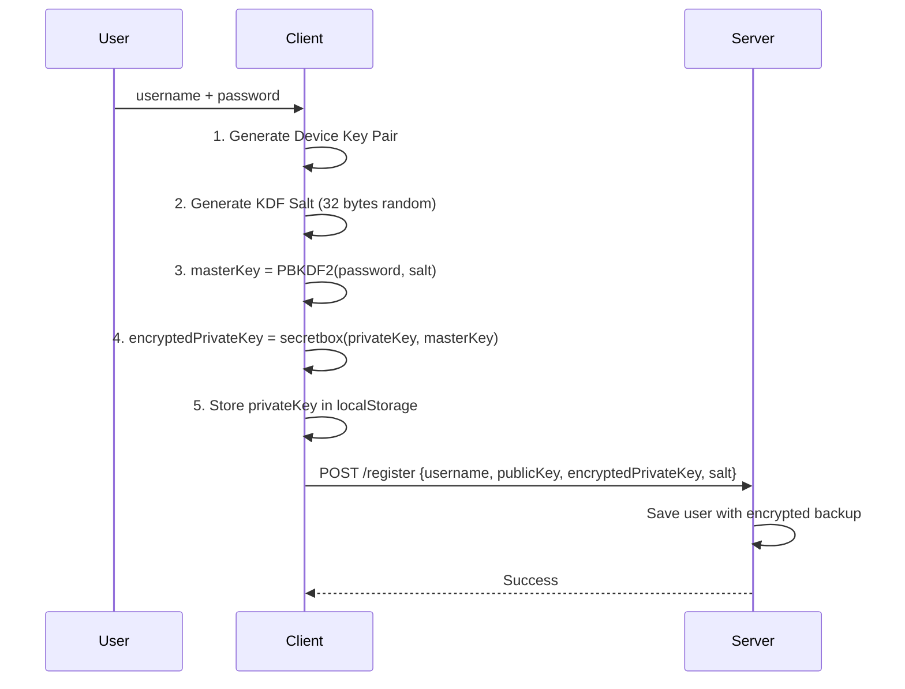
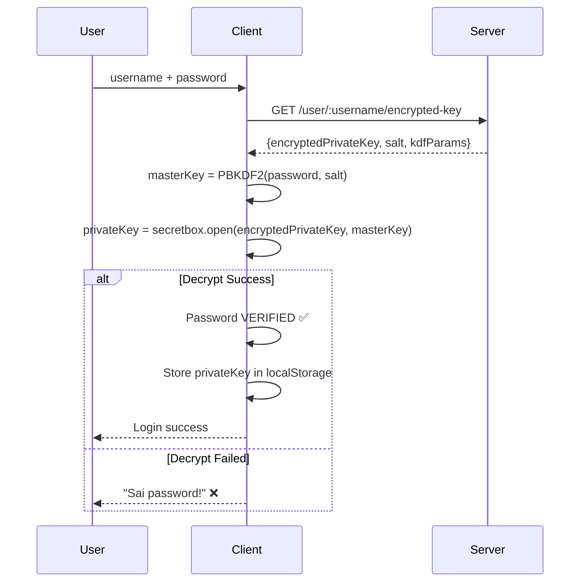
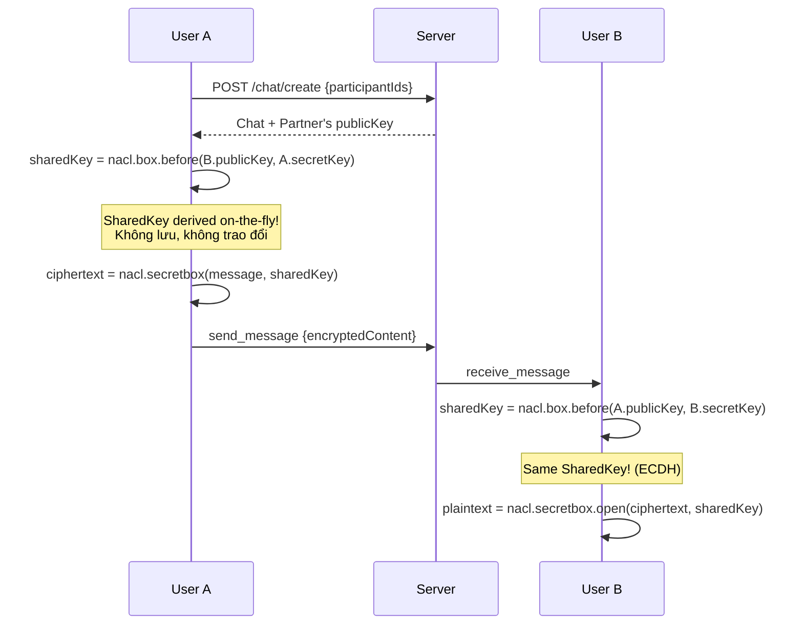

# 🔐 E2E Chat - Encryption Documentation

## Overview

Ứng dụng chat end-to-end encrypted sử dụng **NaCl (TweetNaCl)** với cơ chế:

- **Derived SharedKey** từ public/private keys (Signal-style)
- **Password-Derived Key Backup** để khôi phục private key trên thiết bị mới

---

## 🔑 Key Hierarchy

```
┌─────────────────────────────────────────────────────────────────┐
│                    PASSWORD-DERIVED KEY BACKUP                   │
├─────────────────────────────────────────────────────────────────┤
│                                                                  │
│   Password (user input)                                         │
│       │                                                          │
│       ▼ PBKDF2 (600K iterations, SHA-256)                       │
│   ┌─────────────┐                                                │
│   │ Master Key  │  32 bytes, tạm thời trong memory              │
│   └──────┬──────┘                                                │
│          │ nacl.secretbox                                        │
│          ▼                                                       │
│   ┌─────────────────────┐                                        │
│   │ Encrypted Private   │  Lưu trên Server                      │
│   │ Key + Nonce + Salt  │  (User KHÔNG lưu password)            │
│   └─────────────────────┘                                        │
│                                                                  │
└─────────────────────────────────────────────────────────────────┘

┌─────────────────────────────────────────────────────────────────┐
│                    E2E MESSAGE ENCRYPTION                        │
├─────────────────────────────────────────────────────────────────┤
│                                                                  │
│   Device Key Pair (nacl.box.keyPair)                            │
│   ├── publicKey   → Lưu trên Server (public)                    │
│   └── secretKey   → Lưu localStorage + Backup encrypted         │
│                                                                  │
│   ┌─────────────────────────────────────────────────────────────┐
│   │ SharedKey = nacl.box.before(theirPublicKey, mySecretKey)   │
│   │                                                              │
│   │ User A: box.before(B.publicKey, A.secretKey) = SharedKey   │
│   │ User B: box.before(A.publicKey, B.secretKey) = SharedKey   │
│   │                        ↓                                     │
│   │              SAME SharedKey! (ECDH magic)                   │
│   └─────────────────────────────────────────────────────────────┘
│          │                                                       │
│          ▼ nacl.secretbox                                        │
│   ┌─────────────┐                                                │
│   │ Ciphertext  │  Encrypted message                            │
│   └─────────────┘                                                │
│                                                                  │
└─────────────────────────────────────────────────────────────────┘
```

---

## 🔄 Flows

### 1. Registration (Đăng ký)



### 2. Login (Đăng nhập)



### 3. Start Chat (Bắt đầu chat)



---

## 🔐 Security Properties

| Property             | Implementation                                  |
| -------------------- | ----------------------------------------------- |
| **E2E Encryption**   | nacl.secretbox (XSalsa20-Poly1305)              |
| **Key Agreement**    | nacl.box.before (X25519 ECDH)                   |
| **Password KDF**     | PBKDF2 with 600K iterations                     |
| **Nonce**            | 16 random bytes + 8 counter bytes               |
| **Server Knowledge** | publicKeys only, KHÔNG biết messages/privateKey |

### ⚠️ Important Notes

1. **Password không gửi lên server** - chỉ dùng để derive Master Key local
2. **Server không thể decrypt messages** - không có private keys
3. **Quên password = MẤT private key** - không thể recover chat history
4. **SharedKey derived on-the-fly** - không lưu trong DB (giống Signal)

---

## 📁 Code Structure

```
backend/
├── app.js           # Express + Socket.IO server
├── chat.model.js    # MongoDB schemas (User, Chat, Message)
└── connectDb.js     # MongoDB connection

frontend/src/
└── App.jsx          # React app with crypto functions
    ├── generateKeyPair()      # nacl.box.keyPair
    ├── deriveSharedKey()      # nacl.box.before
    ├── deriveKeyFromPassword() # PBKDF2
    ├── encryptPrivateKey()    # nacl.secretbox
    ├── decryptPrivateKey()    # nacl.secretbox.open
    ├── encryptMessage()       # nacl.secretbox
    └── decryptMessage()       # nacl.secretbox.open
```

---

## 🧪 Testing

### Test 1: Wrong Password Login

1. Đăng ký user với password "abc123"
2. Refresh page
3. Đăng nhập với password "wrong" → Báo "Sai password!"

### Test 2: Key Recovery

1. Đăng ký user
2. Clear localStorage (DevTools → Application → Clear)
3. Đăng nhập với password đúng → Key recovered từ server

### Test 3: E2E Chat

1. Đăng ký 2 users (2 browser tabs)
2. User A chat với User B
3. Kiểm tra cả 2 decrypt được messages

---

## 📚 References

- [NaCl Crypto Library](https://nacl.cr.yp.to/)
- [TweetNaCl.js](https://tweetnacl.js.org/)
- [Signal Protocol](https://signal.org/docs/)
- [X25519 Key Agreement](https://en.wikipedia.org/wiki/Curve25519)
